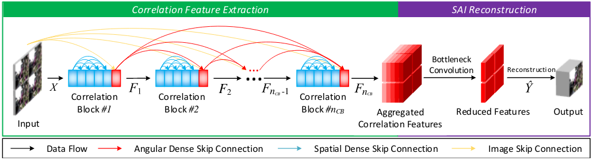
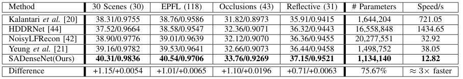
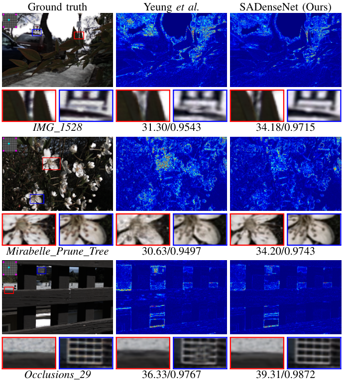

# SADenseNet
This repo is the implementation of Spatio-angular Dense Network (SADenseNet) for light field reconstruction.
> **Efficient Light Field Reconstruction via Spatio-Angular Dense Network**   
> Zexi Hu; Henry Wing Fung Yeung; Xiaoming Chen; Yuk Ying Chung; Haisheng Li   
> IEEE Transactions on Instrumentation and Measurement (2021)   
> [[IEEE Xplore]](https://ieeexplore.ieee.org/document/9497073)  [[arXiv]](https://arxiv.org/abs/2108.03635)







## Prerequisite
### Dependencies

Python 3.6   
Tensorflow 1.15.5 (Tensorflow 2 is not supported.)   
Keras 2.3.1

Running the following command to install the required Python packages:

```bash
pip install -r requirements.txt
```


### Data Preparation

As the light field files are substaintially larger than regular image files, this repo using HDF5 format to store and preload the needed LF images for both training and testing.

To obtain the HDF5 files, two options are provided:

1. Download the generated HDF5 files we provided in [this page](https://unisydneyedu-my.sharepoint.com/:f:/g/personal/zehu6197_uni_sydney_edu_au/Ej2faHBEGV9BtGbOpZuBZV4BKh34A2IoR9nQVbArXs4SDw?e=RsyOan) and put them under the `data` folder.
2. Do it yourself following the instruction below.

NOTICE: Beware of your disk space as the HDF5 files will be huge.

#### Do It Yourself

Modify the `datasets` variable in `prepare.py` to specify which datasets to be prepared, and then following the instruction below to have raw data and configuration ready. The HDF5 files will be placed in `dir_data` variable in `config.py`.

**30Scenes (Kalantari)**

1. Visit [the page](https://cseweb.ucsd.edu/~viscomp/projects/LF/papers/SIGASIA16/) to download the training and test sets and unzip them somewhere. As a result, there should be two folders, namely `TrainingSet` and `TestSet`.
2. In `components/datasets/lytro/KalantariDataset.py`, modify `path_raw` to the path containing the two folders mentioned in the last step.
3. If your intention is just the test set, comment out `Dataset.MODE_TRAIN` in `list` variable in `components/datasets/lytro/KalantariDataset.py` to save time.
4. Run `python prepare.py`.


**Stanford Lytro Light Field Archive** 

1. Visit the [the official website](http://lightfields.stanford.edu/LF2016.html) to download `Occlusions` and `Refelctive` categories, and unzip them in the same folder.
2. In `components/datasets/lytro/StanfordDataset.py`, modify `path_raw` to the unzipped folder.
3. Run `python prepare.py`.


**EPFL**

1. The original data was downloaded from [the official website](https://www.epfl.ch/labs/mmspg/downloads/epfl-light-field-image-dataset/) or [the alternative website](http://plenodb.jpeg.org/lf/epfl/) and converted from `.mat` files to `.png` files. Unfortunately, the conversion code is lost while the PNG files are kept [here](https://unisydneyedu-my.sharepoint.com/:f:/g/personal/zehu6197_uni_sydney_edu_au/EqilAgnij_tItRBhuropfVUBpHcKXJ0e1Ucl9JhtgN3xyg).
2. In `components/datasets/lytro/EpflDataset.py`, modify `path_raw` to the unzipped folder.
3. Run `python prepare.py`.

### Model

1. We provide the pre-trained models mentioned in the paper in [the release page](https://github.com/huzexi/SADenseNet/releases). Download them and put it somewhere, e.g. the `models` folder.
2. In `config.py`, change the corresponding variables in the `Network` section for the model you choose. The default configuration is for the full SADenseNet variant `ISA_651` which provides the best performance.

## Benchmarking

Simply run the following command:

```bash
python --model /path/to/model.hdf5 --bgr --diff --mp 1
```

Assuming we are benchmarking on `30Scenes`:

1. `--mp` enables multiprocessing when it is larger than 0 while you can disable it by set it to 0. Default to 1.
2. `--bgr` enables image rendering into PNG files in `tmp/test/30Scenes`.
3. `--diff` enables error map rendering in `tmp/test/30Scenes.diff` to visualize the reconstruction performance.

The result will be output to `tmp/test/test_model_30Scenes.csv` with PSNR, SSIM and running time for each sample:

```csv
sample,psnr,ssim,time
IMG_1085_eslf,44.03,0.9859,1.58
IMG_1086_eslf,46.95,0.9925,1.66
IMG_1184_eslf,44.04,0.9789,1.08
IMG_1187_eslf,43.77,0.9837,1.16
```

## Citation

If you find our research helpful, please cite the paper.

```bib
@article{hu_TIM2021_SADenseNet,
  title={Efficient Light Field Reconstruction via Spatio-Angular Dense Network},
  author={Hu, Zexi and Yeung, Henry Wing Fung and Chen, Xiaoming and Chung, Yuk Ying and Li, Haisheng},
  journal={IEEE Transactions on Instrumentation and Measurement},
  volume={70},
  pages={1--14},
  year={2021},
  publisher={IEEE}
}
```
